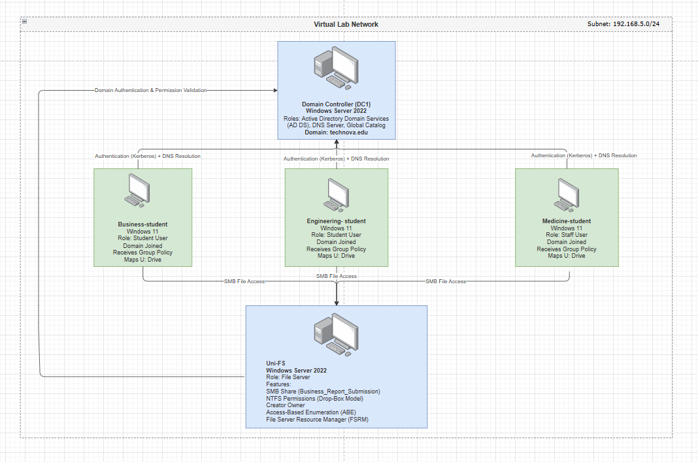
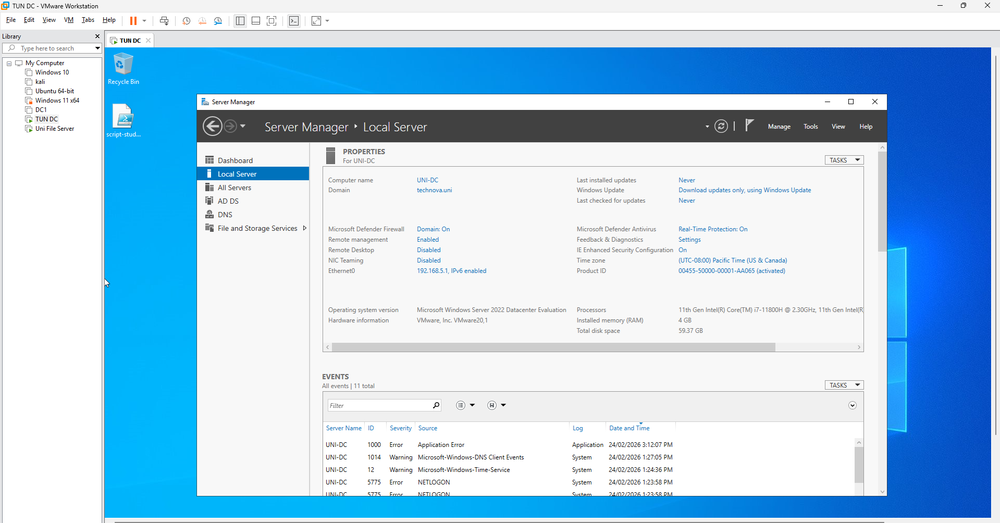
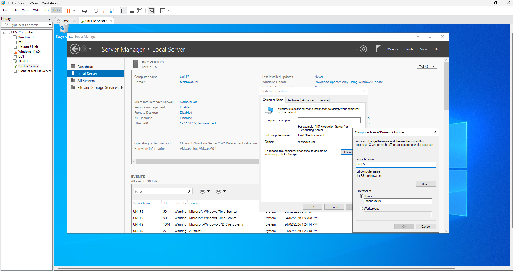
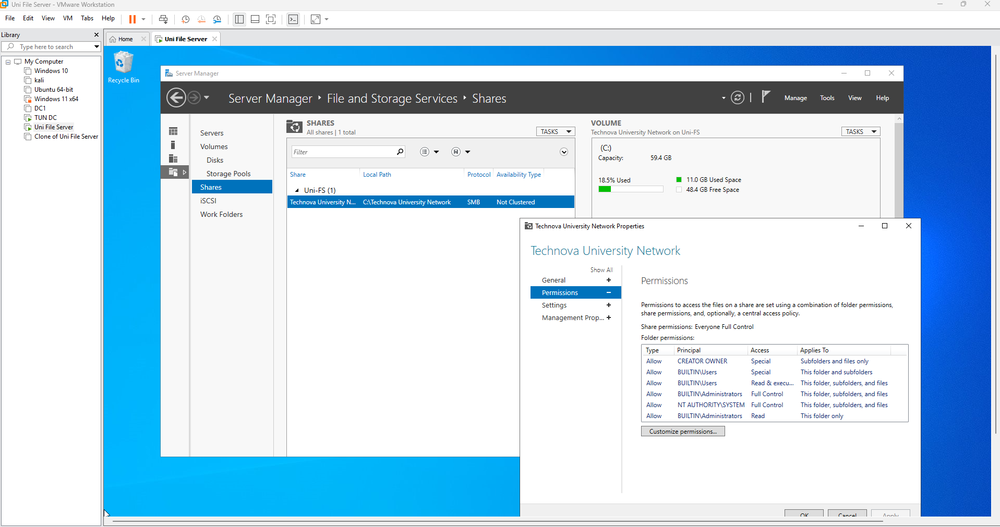
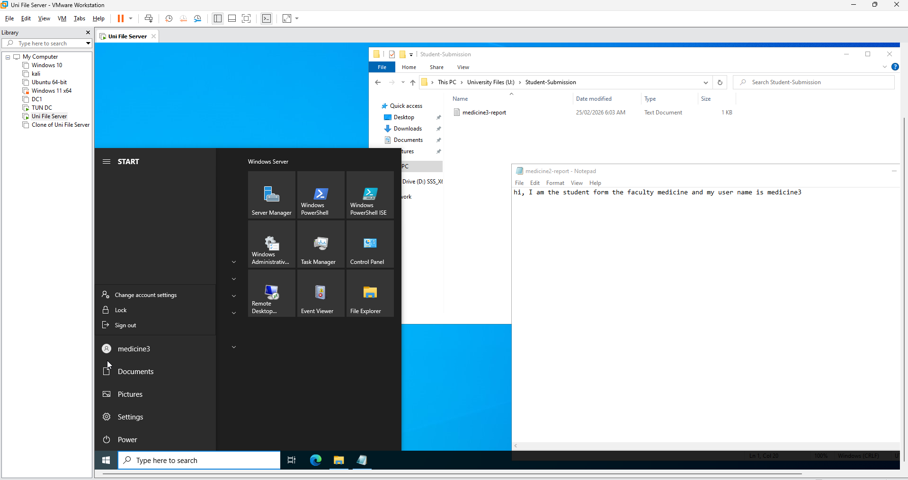
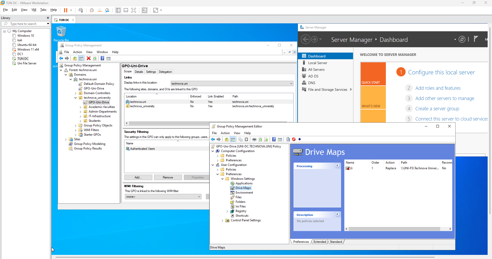
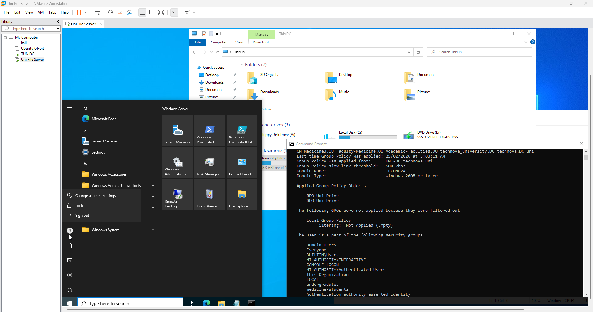

# Enterprise Active Directory & File Server Lab

Simulated a full university-style Windows Server 2022 environment with Active Directory, secure file server, Group Policy automation, and FSRM for data governance. Built using VMware virtualization to mimic real enterprise infrastructure.

## Table of Contents

1. [Project Overview](#project-overview)
2. [Architecture Diagram](#architecture-diagram)
3. [Infrastructure & Identity Setup](#infrastructure--identity-setup)
4. [File Server Engineering](#file-server-engineering)
5. [Group Policy Automation](#group-policy-automation)
6. [Security & FSRM](#security--fsrm)
7. [Troubleshooting](#troubleshooting)
8. [Skills Demonstrated](#skills-demonstrated)
9. [Screenshots](#screenshots)

## Project Overview

This lab simulates a real-world enterprise Active Directory environment for a university scenario. 
The environment includes:

- Domain Controller (Windows Server 2022) named as: UNI-DC
- Member File Server named "Uni-FS."
- Client PCs (Windows 10/11)
- Secure file storage with advanced NTFS permissions
- Group Policy automation for drive mapping and folder redirection
- File Server Resource Manager (FSRM) for file screening
- Enable access based Enumeration
- Virtualized setup using VMware/Hyper-V

## Architecture Diagram

The network topology of the lab environment:

- DC1: Domain Controller (technova.edu)
- Uni-FS: Member File Server
- Client PC: Domain-joined Windows 10/11
- DNS: Points to DC1

## Infrastructure & Identity Setup

In this step, the Active Directory domain and foundational identity structure were built to simulate a real enterprise environment.

- Installed **Windows Server 2022** and configured **Domain Controller (DC1)**.
- Created Active Directory domain: **technova.edu**.
- Designed Organizational Units (OUs) to logically separate accounts:
  - **Students OU**
  - **Staff OU**
  - **Admins OU**
- Created Security Groups for scalable permission management:
  - **Business_Students**
  - **Staff_Group**
  - **Admin_Group**
- Joined secondary server **Uni-FS** to the domain for file server integration.
- Entire environment virtualized using **VMware/Hyper-V**.

### Screenshots

To demonstrate the setup and provide visual proof:

1. **AD Structure & Security Groups**  
   Shows the OU hierarchy and groups created.  
   

2. **Domain Controller Roles** *(Optional but recommended)*  
   Shows that **AD DS** and **DNS** roles are installed and domain name is `technova.edu`.  
   

3. **Member Server Join** *(Optional but recommended)*  
   Shows that Uni-FS is successfully joined to the domain.  
   

## File Server Engineering

The Uni-FS member server was configured as a centralized storage system for student report submissions.

- Deployed secondary Windows Server (Uni-FS) and joined it to the domain.
- Configured SMB network share: **Business_Report_Submission**.
- Designed a secure “Drop-Box” permission model using NTFS.
- Implemented **Creator Owner** to ensure users automatically become owners of their uploaded files.
- Enabled **Access-Based Enumeration (ABE)** to hide unauthorized folders from users.
- Applied Security Group-based access control instead of per-user permissions.

### Security Model

- Students:
  - Can upload reports.
  - Cannot view other students’ files.
- Admins:
  - Full Control for oversight and management.

### Screenshots

1. SMB Share Configuration (Server Side)  

2. NTFS Advanced Permissions – Creator Owner Implementation (Server Side)  

3. Access-Based Enumeration (ABE) Enabled (Server Side)  

4. Student View – Secure Drop-Box Model in Action (Client Side)  

## Group Policy Automation

Group Policy Objects (GPOs) were implemented to automate user experience and enforce centralized management.

- Created GPO to automatically map **U: Drive** to the file server upon login.
- Configured **Folder Redirection** for the Documents folder to store user data on Uni-FS.
- Ensured persistent access to files across multiple client machines.
- Verified policy application using:
  - gpupdate /force
  - gpresult /r

### Screenshots

1. GPO Drive Mapping Configuration  

3. gpresult Verification Output  

## Security & FSRM

File Server Resource Manager (FSRM) was deployed to enforce storage governance and prevent misuse.

- Installed **File Server Resource Manager** role on Uni-FS.
- Created Active File Screening policy.
- Blocked high-risk and non-academic file types:
  - .exe (prevent malware / unauthorized software)
  - .mp3
  - .mp4
- Enforced policy in real-time using Active Screening.

### Security Objective

- Reduce malware risk.
- Prevent storage abuse.
- Enforce controlled file submission standards.

### Screenshots
1. Active File Screen Configuration  

